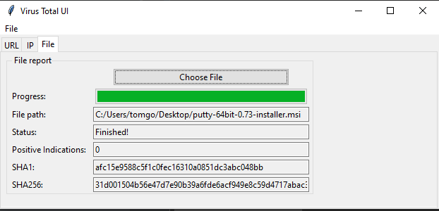

# virusTotal-ui-python
#### Study Python & Cyber Security by implementing Virus Total functions in a tkinter UI!

This project demonstrates how to build a VirusTotal client which is using the VirusTotal REST API, together with a tkinter UI.
Good for the understanding of:
- REST API's
- Basic security analysis concepts
- UI programming with python & tkinter
- The difference between sync & async operations
- Python classes
- GIT branches, and the proper way to build your features using them

Designed for software engineers who are interested in cyber security, and cyber security engineers who are interested in software engineering :)
 
The code is heavily documented and explains a lot of software engineering concepts such as re-use, maintainability and OOP. 

# How To

1) GIT clone the repo
2) CD into the virusTotal-ui-python folder 
3) Type `pip install -r requirements.txt`
4) inside `confing.ini` file, place an API key. you first have to log in to virus total and generate one (https://support.virustotal.com/hc/en-us/articles/115002100149-API)
4) Type `python Main.py`
